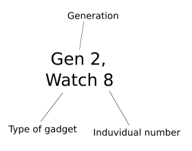

***SPDX-License-Identifier:*** *CC-BY-NC-SA-4.0*

# The Cyborg Gadgets

A project to develop non-invasive, painless body enhancements. 
Beneficial to have all essential tools with you, make the impression to be very smart, and deter adversaries of low intelligence. 

This repository contains a series of programs designed for a customizable multitool cyborg extension. 

The gadgets are all labeled, as seen in the example below:

- **Generation**: The cyborg tools are split into successive generations:

    - The single [Generation 0](./Generation_0/Generation_0.md) gadget is a simple AA battery powered multitool using crocodile clips rather than switches to create a simple multitool gadget. 
    While only a crude prototype, it did provide the inspiration for this project and is therefore counted as the first cyborg extension.
    - [Generation 1](./Generation_1/Generation_1.md) featured a simple parallel circuit on a circuit board, introducing switches and using a LiPo battery for size. 
    - The [second generation](./Generation_2/Generation_2.md) still retained the same circuit, however was built with wires rather than a prototype board. 
    This enhanced its lifespan from roughly 3 weeks to more than 2 years, while also making assembly easier. Currently they are the largest generation, with over 12 known gadgets.
    - [Generation 3](./Generation_3/Generation_3.md) still had a similar aesthetics and functions to its former generation, however introduced a more complex component: an SA56 7-segment display. This improved communication, however this involved adding too many unneccesary wires, so consequently it is a very small generation.  
    - Currently in [Generation 4](./Generation_4/Generation_4.md), the cyborg extension relies on the Arduino platform to drastically enhance capabilities to include smart, multifunctional spy features. Surprisingly, energy consumption is reduced.
    - [Fifth generation](./Generation_5/Generation_5.md) cyborg gadgets will switch from [AVR microcontrollers]() to [ESP32](https://www.espressif.com/en/products/socs/esp32-c3) based platforms, significantly improving capabilities while retaining small form factor.

- **Type of gadget**: While originally focused on watch extensions, the project now includes devices for:

    - Watches
    - Badges
    - Gloves
    - Necklaces
    - Bags

- **Induvidual number**: Within each generation and gadget type, every device is given a unique number, typically assigned in order of production. 